# Diagrama de Clases — Plataforma Fintech de Billeteras Digitales

## Diagrama General del Sistema

```mermaid
classDiagram
    direction TB

    %% ========== ESTRUCTURAS DE DATOS ==========

    class SimpleLinkedList~T~ {
        -Node~T~ head
        -Node~T~ tail
        -int size
        +addFirst(T data) void
        +addLast(T data) void
        +add(int index, T data) void
        +removeFirst() T
        +removeLast() T
        +remove(int index) T
        +get(int index) T
        +getFirst() T
        +getLast() T
        +contains(T data) boolean
        +indexOf(T data) int
        +size() int
        +isEmpty() boolean
        +clear() void
        +iterator() Iterator~T~
        +toJavaList() List~T~
    }

    class DoublyLinkedList~T~ {
        -DNode~T~ head
        -DNode~T~ tail
        -int size
        +addFirst(T data) void
        +addLast(T data) void
        +add(int index, T data) void
        +removeFirst() T
        +removeLast() T
        +remove(int index) T
        +get(int index) T
        +getFirst() T
        +getLast() T
        +contains(T data) boolean
        +indexOf(T data) int
        +size() int
        +isEmpty() boolean
        +clear() void
        +iterator() Iterator~T~
        +iteratorReverse() Iterator~T~
        +toJavaList() List~T~
    }

    class Stack~T~ {
        -SimpleLinkedList~T~ list
        +push(T data) void
        +pop() T
        +peek() T
        +isEmpty() boolean
        +size() int
        +clear() void
        +iterator() Iterator~T~
    }

    class Queue~T~ {
        -SimpleLinkedList~T~ list
        +enqueue(T data) void
        +dequeue() T
        +peek() T
        +isEmpty() boolean
        +size() int
        +clear() void
        +iterator() Iterator~T~
    }

    class PriorityQueue~T~ {
        -SimpleLinkedList~T~ list
        +enqueue(T data) void
        +dequeue() T
        +peek() T
        +isEmpty() boolean
        +size() int
        +clear() void
        +iterator() Iterator~T~
    }

    class BinarySearchTree~T~ {
        -BSTNode~T~ root
        -int size
        +insert(T data) void
        +contains(T data) boolean
        +delete(T data) void
        +min() T
        +max() T
        +inOrder() SimpleLinkedList~T~
        +preOrder() SimpleLinkedList~T~
        +postOrder() SimpleLinkedList~T~
        +rangeSearch(T min, T max) SimpleLinkedList~T~
        +height() int
        +size() int
        +isEmpty() boolean
    }

    class HashTable~K, V~ {
        -SimpleLinkedList~HashEntry~[] buckets
        -int size
        +put(K key, V value) void
        +get(K key) V
        +remove(K key) V
        +containsKey(K key) boolean
        +keys() SimpleLinkedList~K~
        +values() SimpleLinkedList~V~
        +size() int
        +isEmpty() boolean
        +clear() void
    }

    class Graph~T~ {
        -HashTable~T, SimpleLinkedList~Edge~~ adjacencyList
        -int edgeCount
        +addVertex(T vertex) void
        +removeVertex(T vertex) void
        +addEdge(T from, T to, double weight) void
        +addEdgeWithLabel(T from, T to, double weight, String label) void
        +removeEdge(T from, T to) void
        +getNeighbors(T vertex) SimpleLinkedList~T~
        +getVertices() SimpleLinkedList~T~
        +hasVertex(T vertex) boolean
        +hasEdge(T from, T to) boolean
        +getEdgeWeight(T from, T to) double
        +bfs(T start) SimpleLinkedList~T~
        +dfs(T start) SimpleLinkedList~T~
        +hasCycles() boolean
        +vertexCount() int
        +edgeCount() int
    }

    %% Relaciones de composicion entre estructuras
    Stack --> SimpleLinkedList : usa internamente
    Queue --> SimpleLinkedList : usa internamente
    PriorityQueue --> SimpleLinkedList : usa internamente
    HashTable --> SimpleLinkedList : cubetas
    Graph --> HashTable : lista de adyacencia
    Graph --> SimpleLinkedList : listas de aristas
    Graph --> Queue : BFS
    BinarySearchTree --> SimpleLinkedList : resultados de recorridos

    %% ========== MODELOS ==========

    class User {
        -String id
        -String name
        -String email
        -String phone
        -LocalDateTime registrationDate
        -SimpleLinkedList~Wallet~ wallets
        -DoublyLinkedList~Transaction~ transactionHistory
        -Stack~Transaction~ undoStack
        -SimpleLinkedList~Notification~ notifications
        -SimpleLinkedList~RewardBenefit~ redeemedBenefits
        -int points
        -UserLevel level
        +getId() String
        +getName() String
        +setName(String) void
        +getEmail() String
        +setEmail(String) void
        +getPhone() String
        +setPhone(String) void
        +getWallets() SimpleLinkedList~Wallet~
        +getTransactionHistory() DoublyLinkedList~Transaction~
        +getUndoStack() Stack~Transaction~
        +getNotifications() SimpleLinkedList~Notification~
        +getRedeemedBenefits() SimpleLinkedList~RewardBenefit~
        +getPoints() int
        +setPoints(int) void
        +getLevel() UserLevel
        +setLevel(UserLevel) void
    }

    class Wallet {
        -String code
        -String name
        -WalletType type
        -double balance
        -boolean active
        -String ownerId
        -DoublyLinkedList~Transaction~ transactionHistory
        +getCode() String
        +getName() String
        +setName(String) void
        +getType() WalletType
        +setType(WalletType) void
        +getBalance() double
        +setBalance(double) void
        +isActive() boolean
        +setActive(boolean) void
        +getOwnerId() String
        +getTransactionHistory() DoublyLinkedList~Transaction~
    }

    class Transaction {
        -String id
        -LocalDateTime date
        -TransactionType type
        -double amount
        -String sourceWalletCode
        -String targetWalletCode
        -TransactionStatus status
        -int pointsGenerated
        -double commissionCharged
        -String description
        +getId() String
        +getDate() LocalDateTime
        +getType() TransactionType
        +getAmount() double
        +getSourceWalletCode() String
        +getTargetWalletCode() String
        +getStatus() TransactionStatus
        +setStatus(TransactionStatus) void
        +getPointsGenerated() int
        +setPointsGenerated(int) void
        +getCommissionCharged() double
        +setCommissionCharged(double) void
        +getDescription() String
    }

    class Notification {
        -String id
        -LocalDateTime date
        -NotificationType type
        -String message
        -boolean read
        -String userId
        +getId() String
        +getDate() LocalDateTime
        +getType() NotificationType
        +getMessage() String
        +isRead() boolean
        +setRead(boolean) void
        +getUserId() String
    }

    class ScheduledOperation {
        <<Comparable>>
        -String id
        -LocalDateTime scheduledDate
        -TransactionType type
        -double amount
        -String sourceWalletCode
        -String targetWalletCode
        -String description
        -boolean executed
        +getId() String
        +getScheduledDate() LocalDateTime
        +getType() TransactionType
        +getAmount() double
        +getSourceWalletCode() String
        +getTargetWalletCode() String
        +getDescription() String
        +isExecuted() boolean
        +setExecuted(boolean) void
        +compareTo(ScheduledOperation) int
    }

    class RewardBenefit {
        -String id
        -String name
        -String description
        -int pointsCost
        -boolean redeemed
        -LocalDateTime redeemedDate
        -String userId
        +getId() String
        +getName() String
        +getDescription() String
        +getPointsCost() int
        +isRedeemed() boolean
        +setRedeemed(boolean) void
        +getRedeemedDate() LocalDateTime
        +setRedeemedDate(LocalDateTime) void
        +getUserId() String
    }

    class AuditEvent {
        -String id
        -LocalDateTime date
        -String userId
        -String transactionId
        -RiskLevel riskLevel
        -String description
        -String details
        +getId() String
        +getDate() LocalDateTime
        +getUserId() String
        +getTransactionId() String
        +getRiskLevel() RiskLevel
        +getDescription() String
        +getDetails() String
    }

    class UserPointsEntry {
        <<Comparable>>
        -String userId
        -int points
        +getUserId() String
        +getPoints() int
        +setPoints(int) void
        +compareTo(UserPointsEntry) int
    }

    %% Enums
    class UserLevel {
        <<enumeration>>
        BRONZE
        SILVER
        GOLD
        PLATINUM
        +getMinPoints() int
        +getMaxPoints() int
        +getCommissionRate() double
        +getMaxDailyTransactions() int
        +fromPoints(int) UserLevel
    }

    class TransactionType {
        <<enumeration>>
        DEPOSIT
        WITHDRAWAL
        TRANSFER
        SCHEDULED_PAYMENT
    }

    class TransactionStatus {
        <<enumeration>>
        COMPLETED
        PENDING
        REVERSED
        REJECTED
    }

    class NotificationType {
        <<enumeration>>
        LOW_BALANCE
        SCHEDULED_UPCOMING
        OPERATION_REJECTED
        LEVEL_UP
        BENEFIT_REDEEMED
        SECURITY_ALERT
    }

    class RiskLevel {
        <<enumeration>>
        LOW
        MEDIUM
        HIGH
        CRITICAL
    }

    class WalletType {
        <<enumeration>>
        SAVINGS
        DAILY
        SHOPPING
        TRANSPORT
        INVESTMENT
    }

    %% Relaciones entre modelos
    User "1" *-- "*" Wallet : posee
    User "1" *-- "*" Transaction : historial
    User "1" *-- "1" Stack~Transaction~ : pila deshacer
    User "1" *-- "*" Notification : recibe
    User "1" *-- "*" RewardBenefit : canjea
    User --> UserLevel : nivel actual
    Wallet "1" *-- "*" Transaction : historial
    Wallet --> WalletType : tipo
    Transaction --> TransactionType : tipo
    Transaction --> TransactionStatus : estado
    Notification --> NotificationType : tipo
    AuditEvent --> RiskLevel : nivel de riesgo
    ScheduledOperation --> TransactionType : tipo

    %% ========== SERVICIOS ==========

    class DataStore {
        <<Service>>
        -HashTable~String, User~ usersById
        -HashTable~String, Wallet~ walletsByCode
        -PriorityQueue~ScheduledOperation~ scheduledOps
        -Graph~String~ transferGraph
        -BinarySearchTree~UserPointsEntry~ pointsRanking
        -Queue~Notification~ pendingNotifications
        -SimpleLinkedList~AuditEvent~ auditLog
        -SimpleLinkedList~RewardBenefit~ benefitCatalog
        +getUsersById() HashTable
        +getWalletsByCode() HashTable
        +getScheduledOps() PriorityQueue
        +getTransferGraph() Graph
        +getPointsRanking() BinarySearchTree
        +getPendingNotifications() Queue
        +getAuditLog() SimpleLinkedList
        +getBenefitCatalog() SimpleLinkedList
    }

    class UserService {
        <<Service>>
        -DataStore dataStore
        +registerUser(String, String, String, String) User
        +findUserById(String) User
        +deleteUser(String) void
        +getAllUsers() SimpleLinkedList~User~
        +updateUser(String, String, String, String) User
    }

    class WalletService {
        <<Service>>
        -DataStore dataStore
        +createWallet(String, String, WalletType) Wallet
        +findWalletByCode(String) Wallet
        +deactivateWallet(String) void
        +getUserWallets(String) SimpleLinkedList~Wallet~
    }

    class TransactionService {
        <<Service>>
        -DataStore dataStore
        -RewardService rewardService
        -NotificationService notificationService
        +depositToWallet(String, double) Transaction
        +withdrawFromWallet(String, double) Transaction
        +transferBetweenUsers(String, String, double) Transaction
        +countTodayTransactions(User) int
    }

    class ReversalService {
        <<Service>>
        -DataStore dataStore
        -NotificationService notificationService
        +reverseLastOperation(String) Transaction
    }

    class ScheduledOperationService {
        <<Service>>
        -DataStore dataStore
        -TransactionService transactionService
        +scheduleOperation(ScheduledOperation) ScheduledOperation
        +processAllDue(LocalDateTime) int
        +getPendingOperations() SimpleLinkedList~ScheduledOperation~
    }

    class RewardService {
        <<Service>>
        -DataStore dataStore
        -NotificationService notificationService
        +calculatePointsForTransaction(Transaction) int
        +addPoints(User, int) void
        +redeemBenefit(String, String) void
        +updatePointsRanking(User, int, int) void
        +getRankingInOrder() SimpleLinkedList~UserPointsEntry~
    }

    class NotificationService {
        <<Service>>
        -DataStore dataStore
        +sendNotification(String, NotificationType, String) void
    }

    class FraudDetectionService {
        <<Service>>
        -DataStore dataStore
        +analyzeTransaction(User, Transaction) void
        +analyzeAllUsers() void
        +getAuditEvents() SimpleLinkedList~AuditEvent~
    }

    class AnalyticsService {
        <<Service>>
        -DataStore dataStore
        +getTopWalletsByUsage(int) SimpleLinkedList~String~
        +getTopUsersByTransfers(int) SimpleLinkedList~String~
        +getMostActiveCategories() HashTable~String, Integer~
        +getTotalAmountByDateRange(LocalDateTime, LocalDateTime) double
        +getTransactionFrequencyByType() HashTable~String, Integer~
        +getTransferRelationships() SimpleLinkedList~String~
        +detectCyclesInTransfers() boolean
    }

    %% Dependencias de servicios
    UserService --> DataStore : depende de
    WalletService --> DataStore : depende de
    TransactionService --> DataStore : depende de
    TransactionService --> RewardService : depende de
    TransactionService --> NotificationService : depende de
    ReversalService --> DataStore : depende de
    ReversalService --> NotificationService : depende de
    ScheduledOperationService --> DataStore : depende de
    ScheduledOperationService --> TransactionService : depende de
    RewardService --> DataStore : depende de
    RewardService --> NotificationService : depende de
    NotificationService --> DataStore : depende de
    FraudDetectionService --> DataStore : depende de
    AnalyticsService --> DataStore : depende de

    %% DataStore usa todas las estructuras de datos
    DataStore *-- HashTable : usersById, walletsByCode
    DataStore *-- PriorityQueue : scheduledOps
    DataStore *-- Graph : transferGraph
    DataStore *-- BinarySearchTree : pointsRanking
    DataStore *-- Queue : pendingNotifications
    DataStore *-- SimpleLinkedList : auditLog, benefitCatalog
```

## Leyenda

| Tipo de relacion | Simbolo | Descripcion |
|---|---|---|
| Composicion | `*--` | La clase contenedora posee y gestiona el ciclo de vida del componente |
| Uso / Dependencia | `-->` | La clase utiliza o depende de otra clase |
| Implementacion de interfaz | `<<Comparable>>` | La clase implementa la interfaz Comparable |
| Estereotipo | `<<Service>>` | La clase es un servicio de Spring gestionado por el contenedor IoC |
| Estereotipo | `<<enumeration>>` | Tipo enumerado de Java |
